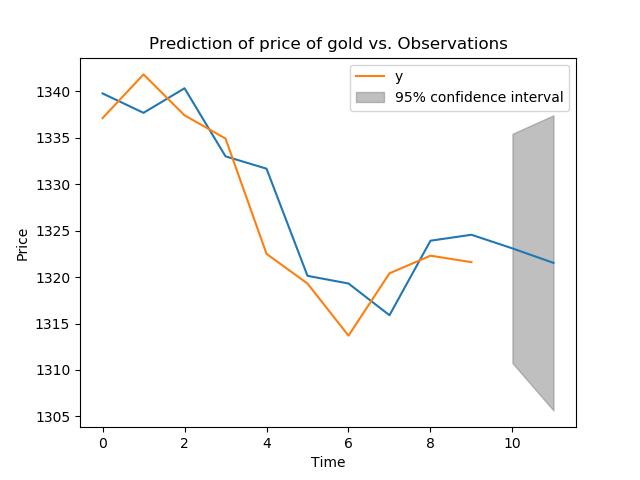

Analysis of historical prices and data of gold and silver  from investing.com
==========================

This project aims at analyzing historical prices and data of [gold](https://www.investing.com/commodities/gold-historical-data) and [silver](https://www.investing.com/commodities/silver-historical-data) from from investing.com 

The code is written in python. There are 3 routines:

* fetchCommodityPrice.py: it is a program to fetch the historical prices and dates of gold and silver from investing.com and store them locally in a csv file. **You need need to set the User-Agent**, in my case is andrea.m1020@gmail.com. Syntax: _python fetchCommodityPrice.py gold_

* getCommodityPrice.py: it is a program that that takes the following 3 arguments in input, namely Start date (e.g. 2017-05-10), End date (e.g. 2017-05-22) and commodity type (either "gold" or silver”). Syntax: _python getCommodityPrice.py 2017-05-01 2017-05-03 gold_

* ADfuller.py: it helps you decide whether the time series (price vs. time) are stationary or not, and whether we can predict if the commodity price are increasing (decreasing). Syntax: _python ADFuller.py silver_
 

For the last task, we aim at determining if the previous gold or silver prices are good predictors for their future prices. For this purpose, it implements the Augmented Dickey-Fuller test to check whether time series is stationary or non-stationary, or -  in different words - how strongly a time series is defined by an  trend underlying noisy data.

Null Hypothesis (H0): the time series has some time-dependent trend.
Alternate Hypothesis (H1): the time series is stationary.

We interpret this result using the p-values, that is a p-value below a fixed threshold (e.g. 1%) indicates that we reject the null hypothesis, otherwise a p-value above that threshold indicates that we accept the null hypothesis.

Finally we train an ARIMA model, use it to make a prediction, and inspect the confidence interval.

The dataset is split into a training (all the observations but the last point) and test dataset (the last single observation). We make a prediction for the latter to be compared with the real measurement.

Note that the alpha argument on the forecast() function specifies the (1-alpha) confidence level. The second last point of the measurement should be coompared (look at the generated plot) to the aformentioned confidence level to assess whether we can predict if the price of the commodidity is increasing or decreasing (in statistically-significant way).
 
 
 
 
We can see the 95% confidence level (gray area) around the predicted value. This can visually capture the range of possible values where an observation can fall in the next time step.